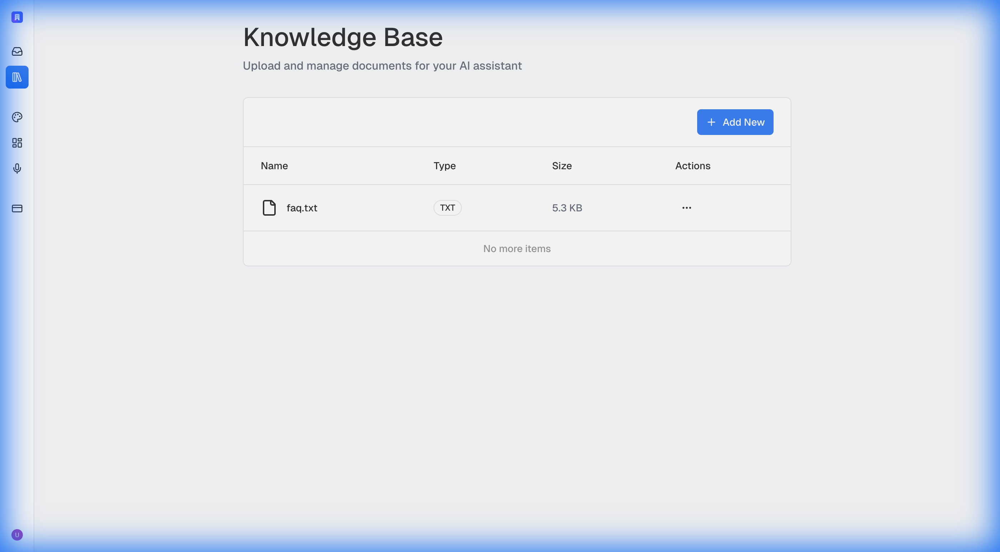
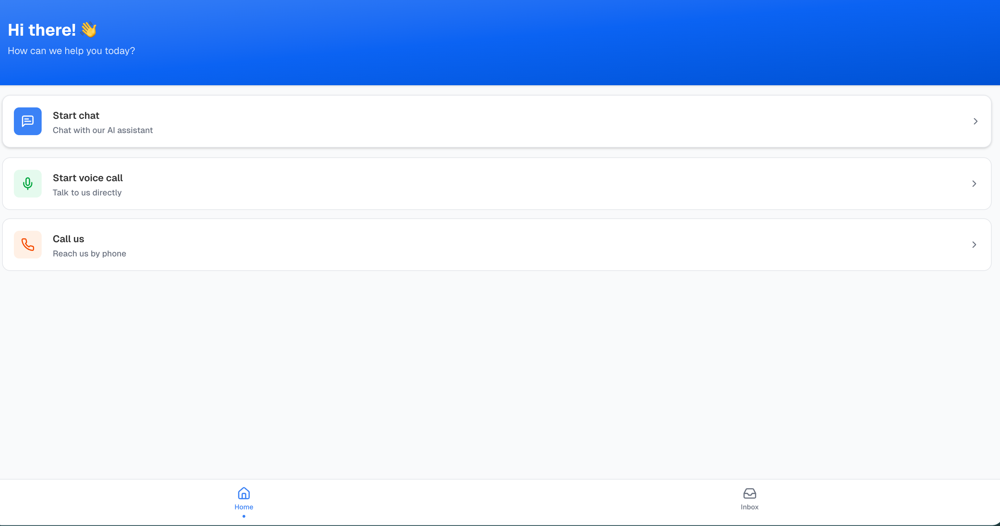
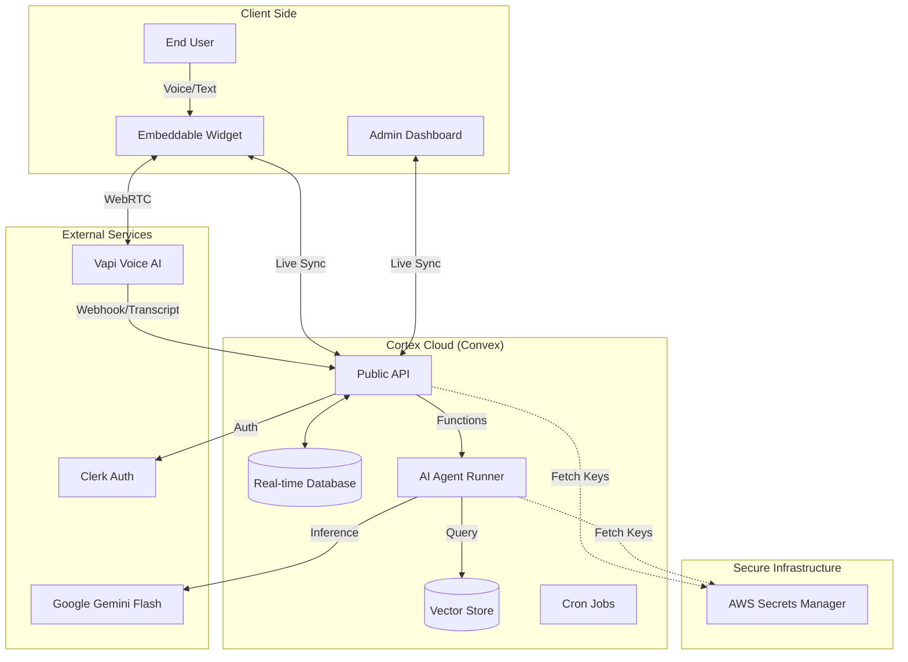
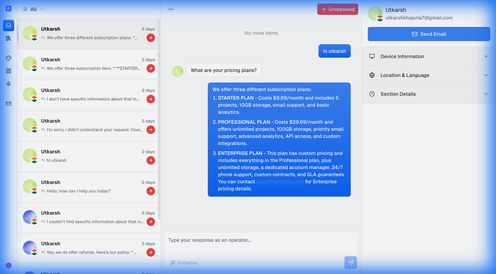
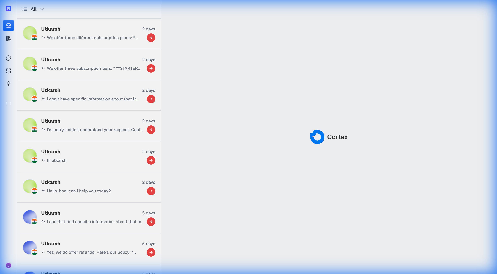

# Cortex 🧠


> **The AI-First Customer Support OS.**
> Bridge the gap between automated intelligence and human connection with a unified, real-time support platform.

**Cortex** is a production-grade, full-stack customer support platform that seamlessly blends **Voice AI**, **RAG-powered Chatbots**, and **Human Agents** into a single, cohesive workflow. Built on a modern, type-safe monorepo, it uses **Convex** for real-time state synchronization, **Vapi** for voice synthesis, and **Google Gemini** for intelligent reasoning.

---

### 🚀 Key Features

- 🤖 **Real-time AI Chat** using Convex Agents
- 📣 **Human Handoff & Auto-Close** using AI Tools
- 🧠 **Smart Knowledge Base** using Embeddings and RAG
- 🔊 **Voice Support** by VAPI
- 🔑 **API Key Storage** by AWS Secrets Manager
- 👥 **Team Management** by Clerk
- 🔐 **Authentication** by Clerk
- 💳 **Subscription Billing** by Clerk
- 🛠️ **Embeddable Widget**
- 📈 **Operator Dashboard** for Managing Conversations
- 🧰 **Developer Toolkit** for Embed Script
- 🧠 **AI Model Support**: OpenAI, Anthropic, Grok
- 🌐 **Built with Next.js 15**
- ⚛️ **Powered by React 19**
- 🎨 **Styled with Tailwind v4**
- 🧩 **Components** from shadcn/ui
- 📦 **Monorepo** managed with Turborepo
- 🪵 **Error Tracking** by Sentry
- 🧑💻 **Pull Request Reviews** by CodeRabbit

---

### 🧠 The Neural Core (AI Agent)
Cortex implements a sophisticated **Agentic Workflow** using `@convex-dev/agent` and Google's Gemini 2.5 Flash model.
- **RAG (Retrieval Augmented Generation)**: Automatically chunks, embeds, and indexes your uploaded PDFs/text files using **Google's `gemini-embedding-001`** model.
- **Tool Use**: The AI agent is equipped with specific tools:
  - `searchTool`: Queries the vector database for answers.
  - `escalateConversationTool`: Recognizes frustration or complexity and hands off to a human.
- **Context Preservation**: The agent maintains full conversation history across sessions.

### � Knowledge Base & AI Training
Train your AI assistant on your own data in seconds.
1. **Upload Documents**: Go to the **Knowledge Base** tab and upload PDF, TXT, or Markdown files.
2. **Auto-Ingestion**: Cortex automatically extracts text, chunks it into manageable pieces, and generates vector embeddings.
3. **Instant Recall**: The AI immediately has access to this new information and cites it when answering customer queries.


### �🗣️ Real-Time Voice Engine
Offer your customers a "talk-to-support" experience directly in the browser.
- **Vapi Integration**: High-fidelity, low-latency voice AI that feels natural.
- **Server-Side Secret Management**: Vapi API keys are stored securely in the backend, not exposed to the client.
- **Transcript Synchronization**: When a call ends or escalates, the **entire voice transcript** is instantly synced to the agent's dashboard so they have full context.

### 🔌 Easy Integration
Deploy the Cortex widget to any website with a single snippet.
- **Universal Script**: Works with HTML, Next.js, React, or any other framework.
- **Copy & Paste**: Generates a pre-configured script with your unique `Organization ID`.

```html
<!-- Example Setup -->
<script 
  src="https://cortex-widget-utk.vercel.app/widget.js" 
  data-organization-id="your-org-id-here"
></script>
```

### ⚡ Reactive Dashboard (Unified Inbox)
A power-packed command center for your support team, built with **Next.js 15** and **Shadcn UI**.
- **Real-Time Updates**: Incoming messages, status changes, and assignments happen in real-time via **Convex Subscriptions**. No page refreshes needed.
- **Human Handoff**: Agents can "Accept" escalated conversations, taking over control from the AI instantly.
- **Customer Context**: Automatically captures and displays user metadata (Location, Timezone, Device, Browser) alongside the chat.

### 🧩 Embeddable Widget
A standalone, high-performance React widget that can be added to any website.
- **Optimistic UI**: Messages appear instantly using **Jotai** for local state management.
- **Customizable**: Change the greeting, primary colors, and behavior via the Admin Dashboard.


### 🛡️ Enterprise Security & Infrastructure
- **Authentication**: Powered by **Clerk** with support for Multi-Factor Authentication (MFA).
- **Row-Level Security (RLS)**: Strict data access policies ensure organizations can only access their own data.
- **Bank-Grade Secret Management**: All third-party API keys (Vapi, Gemini, etc.) are stored in **AWS Secrets Manager**, never in the codebase or client-side bundles.
- **Subscription Management**: Automated webhook handling for subscription status changes (Active/Past Due).

---

## 🏗️ Architecture

Cortex is built as a highly modular **Turborepo** monorepo, ensuring separation of concerns and scalability.



### Project Structure
| Path | Description |
|------|-------------|
| **`apps/web`** | The Admin Dashboard (Next.js 15). Handles auth, billing, and conversation management. |
| **`apps/widget`** | The client-facing chat/voice widget (React). Designed to be lightweight and embeddable. |
| **`apps/landing`** | The marketing landing page (Next.js). Showcases the product. |
| **`packages/backend`** | The Convex backend. Contains the DB schema, API functions, Cron jobs, and AI Agent logic. |
| **`packages/ui`** | Shared UI component library based on Shadcn UI. |

---

## 🛠️ Tech Stack Upgrade

We chose the bleeding edge of web technology for maximum performance and developer experience.

| Category | Technology | Reason |
|----------|------------|--------|
| **Framework** | [Next.js 15](https://nextjs.org/) | Best-in-class React framework with Server Actions. |
| **Database** | [Convex](https://convex.dev/) | Real-time by default. Replaces the need for a separate backend + WebSocket server. |
| **AI Model** | [Gemini 2.5 Flash](https://deepmind.google/technologies/gemini/) | Superior speed and reasoning for real-time chat. |
| **Voice** | [Vapi](https://vapi.ai/) | The best API for handling WebRTC and voice activity detection. |
| **State** | [Jotai](https://jotai.org/) | Atomic state management for the complex widget UI. Prevents re-render hell. |
| **Styling** | [TailwindCSS 4](https://tailwindcss.com/) | rapid UI development with a custom design system. |
| **Monorepo** | [Turbo](https://turbo.build/) | Fast, cached builds across all workspaces. |

---

## 💻 Getting Started

### Prerequisites
- Node.js 20+
- pnpm 9+

### Installation

1. **Clone the repository**
   ```bash
   git clone https://github.com/yourusername/cortex.git
   cd cortex
   ```

2. **Install dependencies**
   ```bash
   pnpm install
   ```

3. **Configure Environment**
   Cortex requires keys for Clerk, Convex, and Vapi.
   
   ```bash
   # Copy example env files
   cp apps/web/.env.example apps/web/.env.local
   cp packages/backend/.env.example packages/backend/.env.local
   ```

4. **Start the Development Server**
   This command starts the backend, dashboard, widget, and landing page simultaneously.
   ```bash
   pnpm dev
   ```

   - **Dashboard**: `http://localhost:3000`
   - **Widget**: `http://localhost:3001`
   - **Convex Dashboard**: `http://localhost:8181`

### Deployment

The project is optimized for deployment on **Vercel**.
1. Connect your GitHub repo to Vercel.
2. Configure the Monorepo settings (Root directory: `.`).
3. Vercel will automatically detect the Next.js apps.
4. Add your Environment Variables in the Vercel dashboard.

---

## 📸 Gallery

<div style="display: flex; gap: 10px; overflow-x: auto; padding-bottom: 20px;">
  
  
  
</div>

---

## 🛡️ License

This project is licensed under the MIT License - see the [LICENSE](LICENSE) file for details.
